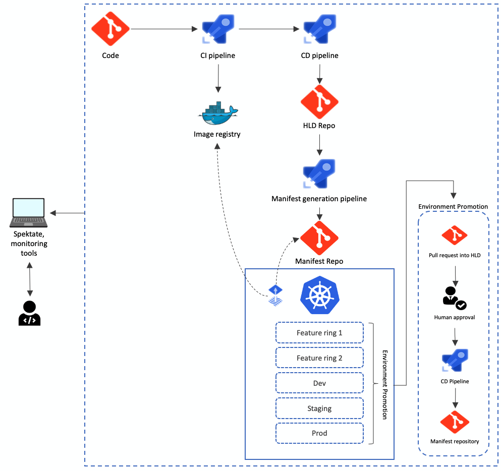
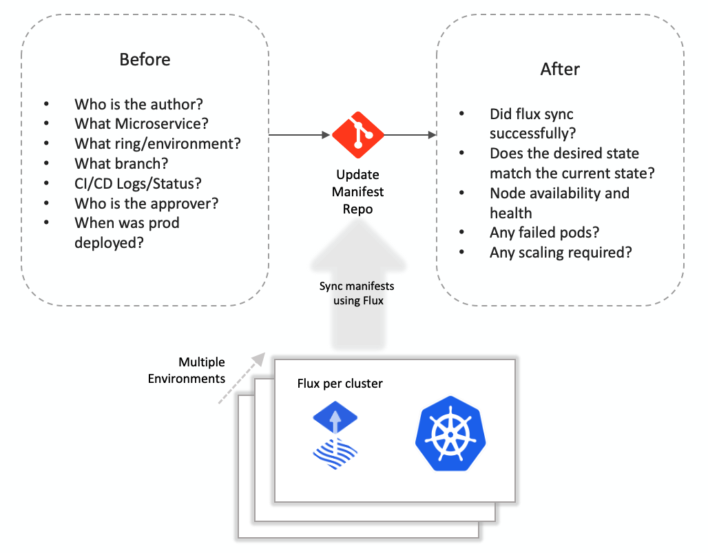

# GitOps Observability - Visualizing the journey of a container

In this blog, I’m going to talk about how I brought a simple web application to run on Kubernetes utilizing a GitOps architecture, and how it helped me understand the process. We’ll also talk about how this led our team to understand the need for visualizing the journey of a container — its creation, its utilization in a K8s resource configuration, its approval to be deployed to a cluster, and so on.

## Project Bedrock

The last few years have seen an incredible rise in popularity for Kubernetes, containers and Infrastructure as code. Kubernetes is created to help with automation, deployment and agile methodologies for building software applications.

My team at Microsoft started collecting our Kubernetes deployment experiences in a project called [Bedrock](https://github.com/microsoft/bedrock). The effort provides a starting point for automating infrastructure management and establishing GitOps pipelines. Being a developer new to Kubernetes and GitOps, I had a huge learning curve — I first began by trying to understand how a simple web application would run on Kubernetes, without using GitOps. This involves creating the Kubernetes resource configuration from ground up, understand YAML configurations, helm charts and all of that. 

## GitOps 

One of the big shifts with the introduction of Kubernetes to the world has been the move towards expressing infrastruction as YAML configuration, and a declarative model. The declarative-ness of Kubernetes makes it an excellent candidate for introducing the concept of GitOps. 

GitOps is a method that helps with application delivery by using Git as a single source of truth and declarative infrastructure, such as Kubernetes. The idea behind GitOps is that engineers are already well versed in Git and can define the state of their application and infrastructure in a git repository, and the application running on Kubernetes is synced to a repository with the help of a tool such as [Flux](https://www.weave.works/oss/flux/), which enables enables continuous delivery of container images. 

GitOps has become increasingly popular with teams running large scale Kubernetes deployments due to its declarative nature, which works perfectly with Git. A git repository holds the Kubernetes resource manifests necessary for the cluster, and Flux constantly polls the repository to apply any new changes. This method allows for easy disaster recovery with the help of reverting commits, and the audit trail it creates comes with it. Everything that comes out of the box with a git repository, such as security, history, branching is an added benefit to the GitOps approach. 


This diagram explains a simplest GitOps scenario - a developer makes a code change to their source repo. The continuous integration pipeline runs to build a container for the application and publishes the new version in their docker registry. A cluster is deployed for this application that has flux installed on it, which is able to pull the latest docker image and apply the change to the cluster. The developer, can now navigate to the URL and see their changes in action. 

## Trivia app

I have a very simple Trivia web application that I would like to host on Kubernetes using the GitOps pattern. It contains a simple React frontend and a nodejs backend that queries existing APIs on the internet for fresh trivia questions. 


Even in a simple application such as this one, there's already two microservices since we have a separate dockerfile for the frontend and backend. This would mean that I need to setup CI pipelines for these individually, and one common CD pipeline should be sufficient to deploy the changes to the cluster. 

I'm following the [5 minutes GitOps pipeline with Bedrock](https://github.com/microsoft/bedrock/blob/master/docs/gitops-quickstart.md) guide which creates a skeleton for all my pipelines and a starter HLD. 

My current setup is outlined below:


### High level definition

Kubernetes manifest files define the final configuration of the deployment on the cluster. Being extremely error prone, helm charts are a great tool for templating Kubernetes resource definitions. In any application, there are multiple microservices (n) and that leads to (n) helm chart configurations. Bedrock uses the concept of a High Level Definition (HLD) that allows you to define the components of your application at a higher level. 

For example, in my Trivia application I need to include the frontend and backend microservices. But at an even higher level, I want to include Traefik in the cluster. I'm looking at having my high level definition at the root folder look something like below: 

```
name: default-component
type: component
subcomponents:
- name: hello-world-full-stack
  type: component
  method: local
  path: ./hello-world-full-stack
- name: traefik2
  source: https://github.com/microsoft/fabrikate-definitions.git
  method: git
  path: definitions/traefik2
```

And the definition at the nested level to be: 

```
name: hello-world-full-stack
type: component
subcomponents:
- name: backend
  type: component
  method: local
  path: ./backend
- name: frontend
  type: component
  method: local
  path: ./frontend
```

Who doesn't love recursion!

[Fabrikate](https://github.com/microsoft/fabrikate) is the tool behind HLD that simplifies the GitOps workflow: it takes this high level description of the deployment, a target environment configuration (eg. QA or PROD) and renders the Kubernetes resource manifests for that deployment by utilizing templating tools such as Helm. As you may have already guessed, it runs as part of the CI/CD pipeline that connects the HLD repository to the final manifest configuration repository! 

### Deployment Rings

I want to setup two environments let's say dev and prod for my application. But I want to run them on the same cluster to cut cost! I also want to be able to test my new features for the Trivia app in their own separate environments before I merge into dev or prod. 

This scenario calls for the concept of Deployment Rings - an encapsulation of a DevOps strategy to group your users into cohorts based on the features of your application you wish to expose to them, similar to A/B or canary testing but in a more formalized manner. Rings allow multiple environments to live in a single cluster with the help of a service mesh, by setting a header on their ingress routes. Each developer in the team would be able to test their features in their own rings before merging it into production.  



## Connecting all the pieces together

Using Bedrock CLI, I created a High Level Definition for my Trivia app and hooked up the CI/CD pipelines for the repositories together. 


This setup involves the following components:

Three repositories:
  - Source code: This is where the source code for the microservices lives, currently all in the same mono repo [here](https://dev.azure.com/epicstuff/hellobedrock/_git/hello-world-full-stack).
  - HLD repo: This is the high level definition repository, located [here](https://dev.azure.com/epicstuff/hellobedrock/_git/hello-world-full-stack-hld). 
  - Manifest repo: This is where the final Kubernetes manifests are stored and the cluster is synced to. Located [here](https://dev.azure.com/epicstuff/hellobedrock/_git/hello-world-full-stack-manifest)

Two pipelines:
  - Build image: This pipeline builds the docker image using the Dockerfile for the microservice(s) and writes the updated image tag to the HLD repository
  - Manifest generation: This pipeline uses Fabrikate and helm to generate the manifests for Kubernetes configuration, and pushes them to the manifest repository.

`n` Image registries: 
  - `api`: The images for backend Nodejs app
  - `client`: The images for frontend Reactjs app

There are too many elements involved this GitOps configuration. In any real world application, it's fair to conclude that we're introducing a lot of complexity into the Ops pattern by going with this pattern. How do we get a high level visual of what is happening in the state of things? How do I know which developer in the team I should contact when something breaks in production?

## Spektate - A Customizable GitOps Observability tool

Spektate is a React based visualization tool that "observes" your entire GitOps process at a high level (and hence the name Spektate). GitOps Observability is currently a loosely defined term that aims to observe the GitOps process, it could include any of the following questions. 



As we were building Spektate, we drew the line between the before and after - what happens before the desired state is updated and what happens after are two separate concerns. There are several tools for monitoring the "after" piece - [Kubernetes dashboard](https://kubernetes.io/docs/tasks/access-application-cluster/web-ui-dashboard/), [Prometheus](https://prometheus.io/), [cAdvisor](https://github.com/google/cadvisor) etc. The "after" piece also needs direct access to the cluster(s). We wanted to build a tool that provides a full high level view of the "before" up until the point where Flux has synced with the cluster, which is a green signal for the developer/operator to know that their change is applied. 


A quick glance at Spektate tells me that a recent change is being deployed into the dev ring, the dev cluster is currently synced to an older deployment, there are currently three rings (dev, master and securitybugfix) in the cluster running simultaneously, and I can click on any of the links to pipelines/code changes to get more details. If a deployment is pending approval, I can also navigate to that and hit approve. 


### Capturing Data

Spektate uses a storage table to capture the details of every deployment attempt in the GitOps process. When the first code change is made to the source code, it's associated with a docker image, which creates a change in the HLD and eventually makes its way to the manifest when approved. All these details are captured in a storage table using bash scripts inserted into the CI/CD pipelines by bedrock-cli. For this Trivia app, when I used bedrock-cli to configure the pipelines, it created the bash scripts automatically along with a storage container in my Azure subscription. 

### Extensible

Spektate can be easily extended to work with any other storage tables, but currently we've only added support for Azure storage table. If you would like to use it with another CI/CD orchestrator other than Azure DevOps, we've support for GitHub Actions coming soon, and we can apply the same idea to any orchestrator as well. 

### Deployment

Spektate can be deployed in a Kubernetes cluster by using the [helm chart](https://github.com/microsoft/spektate/tree/master/chart) for Spektate. 

### Security

Spektate does not access your cluster directly, it only needs access to your pipelines if they are private and your repositories to gather information. The keys are stored securely using Kubernetes secrets. 

# What next?

We're working to add support for Github Actions into Spektate and make Spektate less dependent on external APIs by capturing all necessary data into the storage table. This will enable us to run Spektate on any ecosystem. We're also looking to make Spektate columns and table more customizable. 

The work in this area is ongoing and there's a long journey ahead - feel free to reach out to us with feedback on [Github](https://github.com/microsoft/spektate) or [Twitter](https://twitter.com/samiyaakhtar). 

# Useful Links

Our presentation at Kubecon 2020 is available on [YouTube](https://www.youtube.com/watch?v=JfQvAtsZP7Y). 

[Spektate](https://github.com/microsoft/spektate)

[Bedrock](https://github.com/Microsoft/bedrock)
- [5 Minute GitOps Pipeline with bedrock](https://github.com/microsoft/bedrock/blob/master/docs/gitops-quickstart.md)
- [Automated Kubernetes deployments with Bedrock](https://docs.microsoft.com/en-us/azure/architecture/example-scenario/bedrock/bedrock-automated-deployments)
- [Deployment rings](https://github.com/microsoft/bedrock-cli/blob/master/guides/rings-101.md#what-are-deployment-rings)

[Fabrikate](https://github.com/microsoft/fabrikate)

[Bedrock-cli](https://github.com/Microsoft/bedrock-cli)

Trivia sample repositories: 
- [Source code](https://dev.azure.com/epicstuff/hellobedrock/_git/hello-world-full-stack).
- [HLD](https://dev.azure.com/epicstuff/hellobedrock/_git/hello-world-full-stack-hld). 
- [Manifest](https://dev.azure.com/epicstuff/hellobedrock/_git/hello-world-full-stack-manifest)

[A sample dashboard](http://40.64.74.69:5000/)
